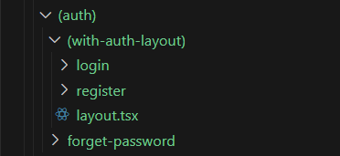

[```Notes```](../README.md)

> # Layout
> - A page is a UI that is unique to a route.
> - A layout is UI that us shared between multiple pages in the app.

> ## How to create layout
> - By default exporting react comp. from ```layout.js``` or ```layout.tsx```.
> - that comp. should accept a children prop that will be populated with a child during rendering.

> ## Nested layout
> - Create individual ```layout``` files for folders.
> - this layout will be applied to thier sub-folders also.
> - But what if we don't want the layout with other folders in same directroy ???. ⬇️ ⬇️

> ## Route group layout
> - Do the same thing  as route group.
> - make a route group folder, put the necessary folder inside it.and  add ```layout``` file.
> - then, layout will only be applied to the inside folders.
>
>    
> - layout applied only on login and register routes.

[```Next - Routing```](./Routing.md)