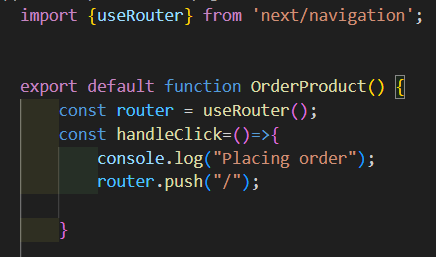

[```Notes```](../../README.md)

> # Navigation
>
> - How to navigate b/w  specific routes from UI.

> ## Link Component
>
> - enable client-side navigation.
> - ```<Link>``` is react comp. which extends html ```<a>``` element.
> - import ```"next/link" ``` to use it. (from next/navigation)
> - ```replace``` prop, replaces the current history state instead of adding a new URL.

> ### Active links
>
> - ```usePathname```  is a Client Component hook that lets you read the current URL's pathname.
> -    it returns the string of current URL

> ## Navigating Programmatically
>
> - After some specific task, route user to somewhere else . how to do it?
>   -  ex- after placing order, route user to home page.
> -  import ```useRouter``` (from next/navigation).
> -  ```useRouter``` is a client component  ( do "use client" on top of page)
> -  then do ```push()``` for routing .
> -  learn about- ```back() forward() replace()``` 
>
>      

[```Next - Template```](./Template.md)
