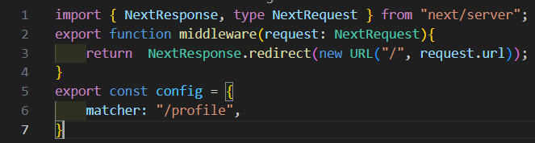
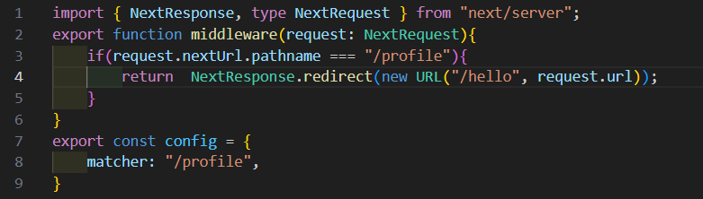
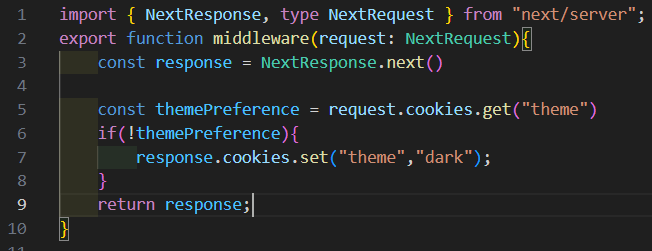
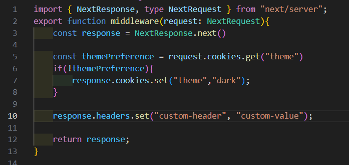

[`Notes`](../../README.md)

> # Middlware
>
> - Middleware in Next.js is a powerful feature that offers a robust way to intercept
>   and control the flow of requests and responses within your applications
> - It does this at a global level significantly enhancing features like redirection, URL
>   rewrites, authentication, headers and cookies management, and more.
> - Middleware allows us to specify paths where it will be active
> - 1. Custom matcher config
> - 2. Conditional statements.
>
> ### how to use
> - Make file `middleware.ts` in `src` folder
>
>  1. Matcher config approach - below code will redirect to homepage , if  ***/profile*** is accessed
>
>   
>
>  2. Conditional statements
>
>   
>
> - We can also use `.rewrite` instead of `.redirect` . This will keep the url same, but changes the content ( taken from new route). This improves the SEO performance.

> ## Cookies with Middleware
>
>   

> ## Headers with Middleware
>
> - Custom headers
>
>   

[`Next - Rendering `](./rendering.md)