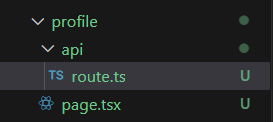
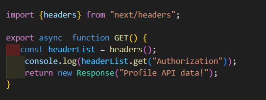

[`Notes`](../../README.md)

# Route Handler

> - We've learnt how to route to pages
> - We can also create custom request handlers for our routes using a feature called Route handlers.
> - Unlike page routes, which respond with HTML content, route handlers allow you to
>   create RESTful endpoints, giving you full control over the response
> - There is no overhead of having to create and configure a separate server
> - Route handlers are also great for making external API requests
> - Route handlers run server-side, ensuring that sensitive information like private
>   keys remains secure and never gets shipped to the browser
> - Route Handlers are the equivalent of API routes in Page router

> ## How to create route handler
>
> - make a folder inside `app` directory.
> - make a file named `route.ts` ( compulsory next js convention for route handler).
> - Example: below sample will create a route **_/hello_**, which returns "hello world ".
>
>    
>   
>   
>
> - We can create nested routes handler like normal routes.

> ### Conflict of page routing - route handler
>
> - To remove conflict of page router with route handler in single folder. do this - create subfolder `api` and give it `route.ts` file
>
>   

> ## GET Request
>
> 

> ## POST Request
>
>  > 

> ## Dynamic route handler
>
>  > 

> ## PATCH Request
>
> 

> ## DELETE Request
>
> 

> ## URLQuery parameters
>
>  > 

> # Headers in route handler
>
> - HTTP headers represent the metadata associated with an API request and
>   response.
>
> ## Request headers
>
> - These are sent by the client, such as a web browser, to the server. They contain
>   essential information about the request, which helps the server understand and
>   process it correctly.
> - **User-Agent** which identifies the browser and operating system to the server.
> - **Accept** which indicates the content types like text, video, or image formats that
>   the client can process.
> - **Authorization** header used b the client to authenticate itself to the server.
>
> ### How to use
>
> - One way of using it -
>
>   
>
> - Or we can do this -
>
>   
>
> ## Response headers
>
> - These are sent back from the server to the client. They provide information about
>   the server and the data being sent in the response.
> - **Content-Type** header which indicates the media type of the response. It tells the
>   client what the data type of the returned content is, such as text/html for HTML
>   documents, application/json for JSON data, etc.
>
> ### How to use
>
> - This example will return data as html and not plain text
>
> 

> # Cookies in route handler
>
> - Cookies are small pieces of data that a server sends to a user's web browser
> - The browser may store the cookie and send it back to the same server with later
requests
>
> - Cookies are mainly used for three purposes
> - 1. Session management like logins and shopping carts
> - 2. Personalization like user preferences and themes
> - 3. Tracking like recording and analyzing user behavior.
>
> ### How to use
>
> - One way of using it -
>
>    
>   
>   
>
> - Or we can do this -
>
>   
>
>   

[`Next - Route Handler`](./Route-handler.md)
