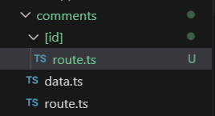

[```Notes```](../../README.md)

#  Route Handler
>
> - We've learnt how to route to pages
> - We can also create custom request handlers for our routes using a feature called
    route handlers
> - Unlike page routes, which respond with HTML content, route handlers allow you to
    create RESTful endpoints, giving you full control over the response
> - There is no overhead of having to create and configure a separate server
> - Route handlers are also great for making external API requests
> - Route handlers run server-side, ensuring that sensitive information like private
    keys remains secure and never gets shipped to the browser
> - Route Handlers are the equivalent of API routes in Page router

> ## How to create route handler 
> - make a folder inside `app` directory.
> - make a file named `route.ts`  ( compulsory next js convention for route handler).
> -  Example: below sample will create a route  ***/hello***, which returns "hello world ".
>
>       
>       
> - We can create nested routes handler like normal routes.

> ### Conflict of page routing - route handler
> - To remove conflict of page router with route handler in single folder. do this - 
>
>    

> ## GET Request
>
>   

> ## POST Request
>
>   
>   

> ## Dynamic route handler
>
>     
>    

> ## PATCH Request
>
>    


[```Next - Route Handler```](./Route-handler.md)