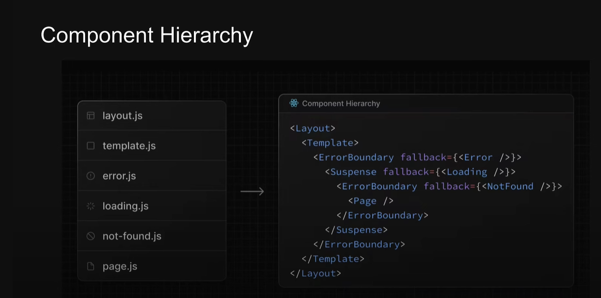
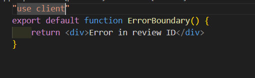
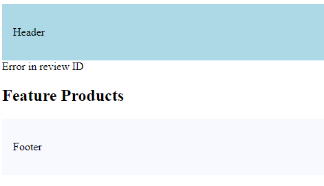
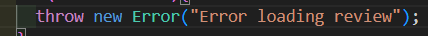
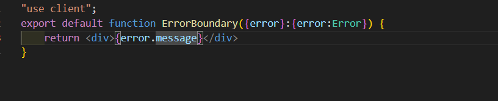
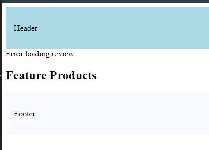
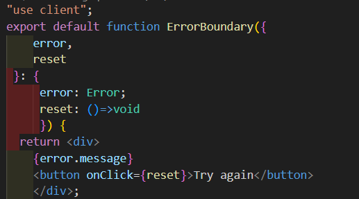

#  Error Handling
>
> - Automatically wrap a route segment and its nested children in a React Error
Boundary
> - Create error Ul tailored to specific segments using the file-system hierarchy to
adjust granularity
> - Isolate errors to affected segments while keeping the rest of the application
functional
> - Add functionality to attempt to recover from an error without a full page reload
>
## Component Hierarchy for all special files
>
>   

## How to use
>
> - Make ```error.tsx``` file in the required folder.
> - It's a client comp. , "use client"
> - give it a function.
> - Whenver error occurs in that folder , this file will show up
>
>   
>
>   
>
> -  Or we can also do
>   
>   
>
>   
>
>   
>
>
> -  To recover from error, Remember to use ```use client``` on main page
>
>    
>
>
>## Handling error in Layout
>
> - An ```error.tsx``` file will handle errors for all its nested child segments.
> - error boundary does not catch errors thrown here bcoz its nested inside layouts comp. (refer to hierarchy image)