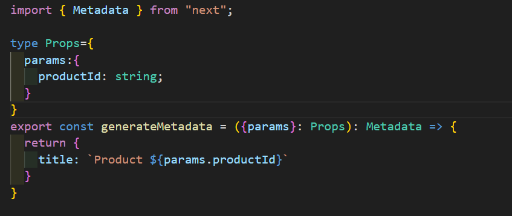
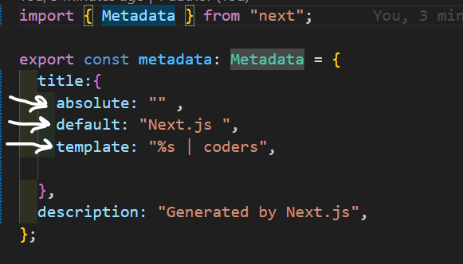

> # Routing MetaData
>
> - Ensuring proper search engine optimization (SEO) is crucial for increasing
>   visibility and attracting users
> - Next.js introduced the Metadata API which allows you to define metadata for each
>   page
> - Metadata ensures accurate and relevant information is displayed when your
>   pages are shared or indexed

> ## Configure MetaData
>
> -Export a static metadata object
> -Export a dynamic generateMetadata function

> ### Configure MetaData
>
> - Both layout.tsx and page.tsx files can export metadata. If defined in a layout, it
applies to all pages in that layout, but if defined in a page, it applies only to that
page
> - Metadata is read in order, from the root level down to the final page level
> - When there's metadata in multiple places for the same route, they get combined,
but page metadata will replace layout metadata if they have the same properties

> ### For dynamic routes
> - here, title changes for every product 
> - we can use async-await also , for fetch call in it.
> 
>   

> ### Title Metadata
> - default - if no title given on page, it will apply the default 
> - template -  %s will be taken from child elements, this template of title will be for child layout.
> - absolute - completely override the title in the template.
> 
>   
