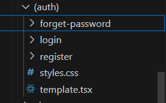
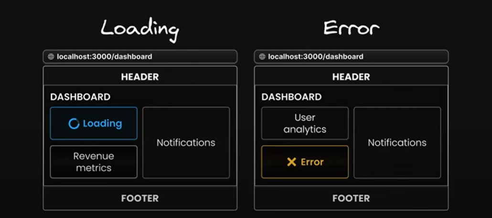
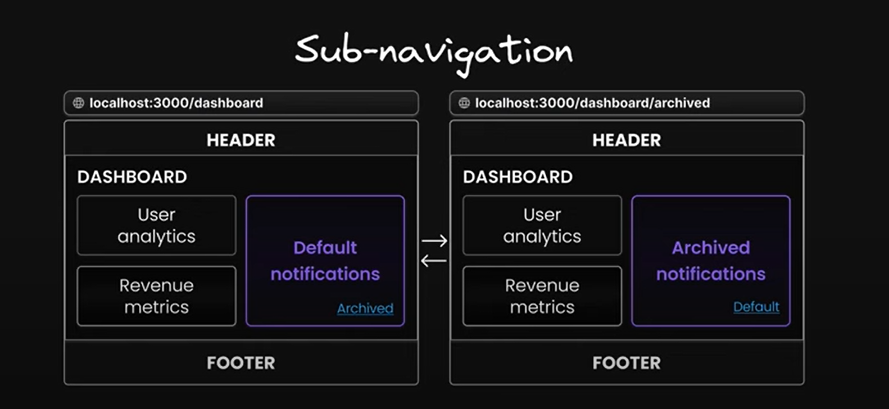

[```Notes```](../README.md)

> # Routing Conventions
> - All routes must be placed inside the ```app``` folder.
> - Every file that corresponds to a route must be named ```page.js``` or ```page.tsx```.
> - Every folder corresponds to a path segment in borowser URL.

> ## Dynamic Routing
> - ``` [productId]``` folder is dynamic route , whose value can be taken by using `params`.
>    - ex - url/products/{product id} ,  then to take the id in code ->  { params.productId }.

> ## Catch all segment
> - ``` [...slug]``` is keyword, that catch-all subsequent segments.  ( and stores in array) 
>
>   
>  -  ex- url/products/a , then to take 'a'->  { params.slug[0] } 
>  -  ex- url/products/a/b , then to take 'b'->  { params.slug[1] } 

> ## 404 page
>  -  Make file name ```not-found.tsx```  in ```app``` folder, this will show up , for wrong routes.
>  -  ```not-found.tsx``` file can be made at multiple places, as per need.
>     - ex- if params.productsId > 100 , then -> make ```not-found.tsx``` file to display error.


> ## Route group
>  -  Group the similar routes , for better developer experience.
>  -  Just make folder with parenthesis, and put the routes in it.
>  -  ex- ```(auth)``` folder will contains route of login,register,forget-password.
>  - This won't affect url it stays same, like  ```url/login```.
>
>    
>


> ## ***Advance Routing***
>
> ### Parallel Routes
> - Parallel routes are an advanced routing mechanism that allows for the simultaneous rendering of multiple pages withiin the same layout.
> ### How to define
> - Parallel roures in Nextjs are defined using feature known as  ***slots***.
> - Slots help structure our content in modular fashion.
> - To define a slot, we use the '@folder' naming convention.
> - Each slot is then passed as a prop to its corresponding 'layout.tsx' file. 
> - slots are not part of url.
>
> ## Benefits
> 1. #### Independent route handling
>  
>
> 2. #### Sub navigation
>   
> 

> ## Unmatched Routes
>
>  ### Navigation from UI
> - In the case of navigation within the IJI, Next.js retains the previously active state of
a slot regardless of changes in the URL.
> ### Page Reload
> - Next.js immediately searches for a `default.tsx` file within each unmatched slot.
> - The presence of this file is critical, as it provides the default content that Next.js
> will render in the user interface.
> - If this `default.tsx` file is missing in any of the unmatched slots for the current route
Next.js will render a 404 error.
>  ### `default.tsx`
> - The `default.tsx` file in Next.js serves as a fallback to render content when the
> framework cannot retrieve a slot's active state from the current URL.
> - You have complete freedom to define the IJI for unmatched routes: you can either
> mirror the content found in page.tsx or craft an entirely custom view


[```Next- Metadata```](./Metadata.md)


