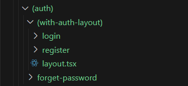

[```Notes```](../README.md)

> # Routing Conventions
> - All routes must be placed inside the ```app``` folder.
> - Every file that corresponds to a route must be named ```page.js``` or ```page.tsx```.
> - Every folder corresponds to a path segment in borowser URL.

> ## Dynamic Routing
> - ``` [productId]``` folder is dynamic route , whose value can be taken by using `params`.
>    - ex - url/products/{product id} ,  then to take the id in code ->  { params.productId }.

> ## Catch all segment
> - ``` [...slug]``` is keyword, that catch-all subsequent segments.  ( and stores in array) 
>
>   
>  -  ex- url/products/a , then to take 'a'->  { params.slug[0] } 
>  -  ex- url/products/a/b , then to take 'b'->  { params.slug[1] } 

> ## 404 page
>  -  Make file name ```not-found.tsx```  in ```app``` folder, this will show up , for wrong routes.
>  -  ```not-found.tsx``` file can be made at multiple places, as per need.
>     - ex- if params.productsId > 100 , then -> make ```not-found.tsx``` file to display error.


> ## Route group
>  -  Group the similar routes , for better developer experience.
>  -  Just make folder with parenthesis, and put the routes in it.
>     -  ex- ```(auth)``` folder will contains route of login,register,forget-password.
> - This won't affect url it stays same, like  ```url/login``` 
>  
>   

[```Next- Metadata```](./Metadata.md)


